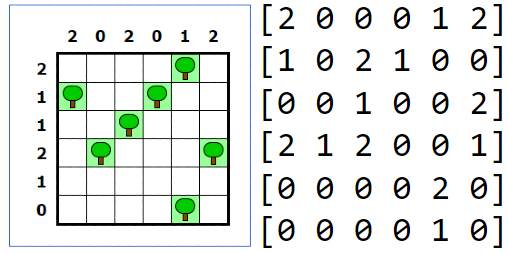
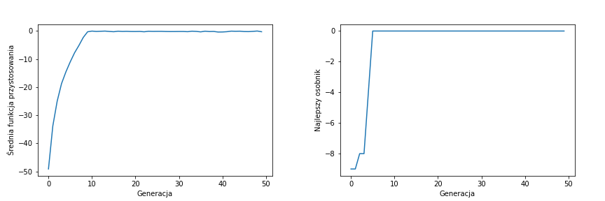

## Overview
Genetic algorithm solving tent puzzle.

## Game rules
▶ connect each tree to a tent
adjacent horizontally or
perpendicularly

▶ tents must not come into contact with
yourself

▶ numbers off the board determine
number of tents in a given
row/column

## Results
Solved 6x6 example:

Change in the average fitness function and the best individual in the generation function:

